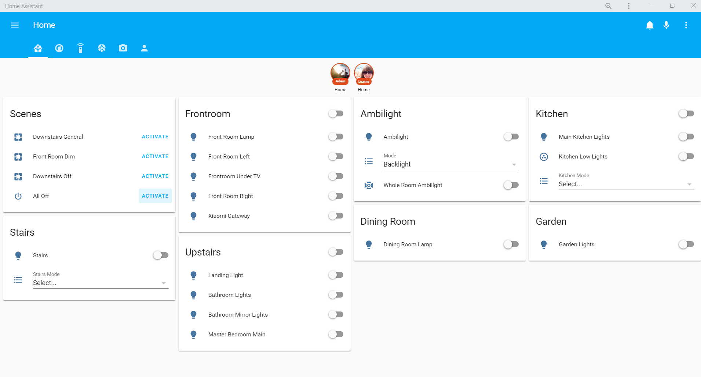
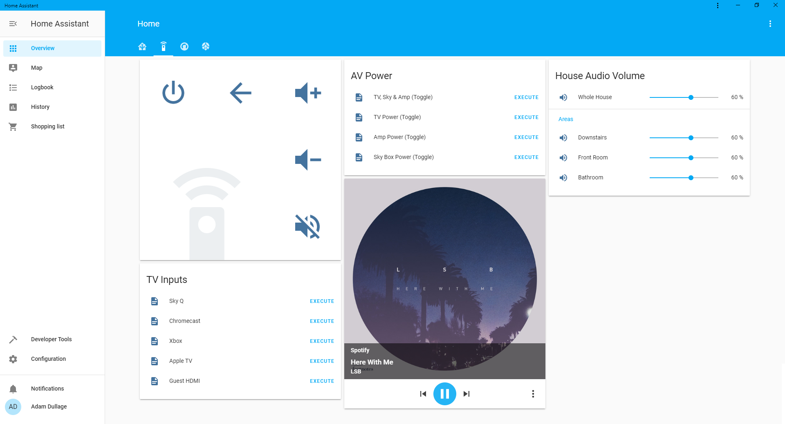
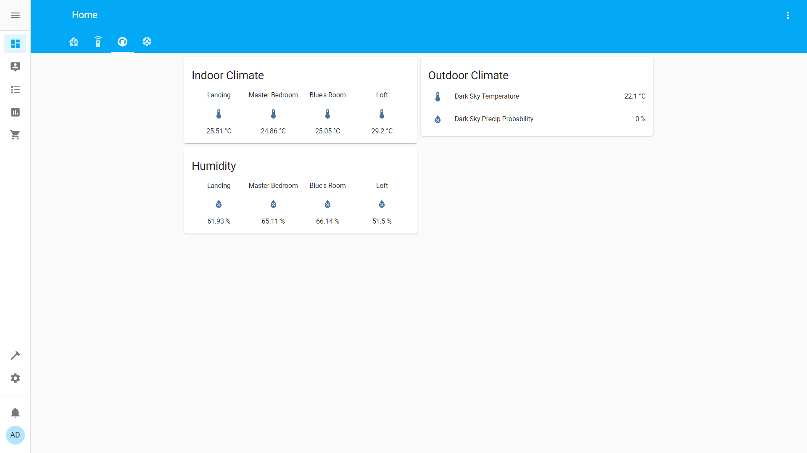
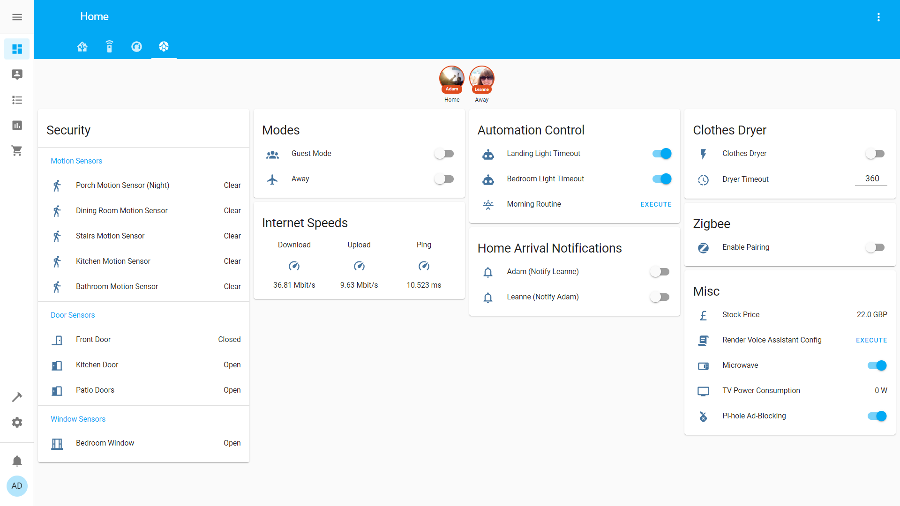

# Setup

I currently run [Home Assistant](http://homeassistant.io/) version 2021.3.4 in a docker container on a Raspberry Pi 4.

All of the automations are commented, see the [automations folder](/config/automations).

# Highlights

Some highlights of our setup in no particular order:

- Google/Nest Home Minis / Google Home Hub for voice control and voice notifications (Google Cast) in most areas of the house.
- Chromecast Audios for whole house audio.
- Most house lights controllable via Home Assistant (a mix of Hue, Sonoff, Shelly and WS2812 LED strips).
- Nest Thermostat.
- Broadlink RM Mini IR blaster for AV control.
- Motion detection for some lighting automations (Xiaomi Motion Sensors).
- The heating turns itself off as we go to bed ([bedtime.yaml](/config/automations/bedtime.yaml)).
- All lights turn off if everyone leaves the house. Lights turn on (at night) when someone comes home ([location_lights.yaml](/config/automations/location_lights.yaml)).
- ESP8266 controlled ceiling lights (see [this forum post](https://community.home-assistant.io/t/esp8266-sonoff-controlled-ceiling-lights/24141)).
- Double toggle a wall switch to perform a special function e.g. turn off every light on that floor (see [this repo](https://github.com/Dullage/SwitchedSonoffSimple) and [double_toggle_actions.yaml](/config/automations/double_toggle_actions.yaml)).
- iOS notifications when the doorbell is pressed ([doorbell.yaml](/config/automations/doorbell.yaml)). These include a video of the person walking up the path (see [this forum post](https://community.home-assistant.io/t/blink-camera-as-video-doorbell/65844)).
- iOS notifications if we both leave the house but a door or window is left open ([leaving_open_cover_warning.yaml](/config/automations/leaving_open_cover_warning.yaml)).
- Wall mounted Amazon Fire Tablet to display HADashboard.
- Smart Microwave! See [this forum post](https://community.home-assistant.io/t/making-my-microwave-smart-ish/89843) and [this automation](/config/automations/microwave.yaml).
- Google Assistant integrated with the Shopping List via IFTTT so I can say "Hey Google, add beer to my shopping list".
- iOS notification to send me the shopping list when I go near a local supermarket. Follow-up notification when I leave the supermarket offering to clear the shopping list.

# Entity Counts

| Type | Count |
| ---- | ----- |
| Automation | 103 |
| Binary Sensor | 26 |
| Camera | 7 |
| Climate | 3 |
| Cover | 1 |
| Device Tracker | 5 |
| Input Boolean | 6 |
| Input Datetime | 1 |
| Input Number | 8 |
| Input Select | 4 |
| Light | 34 |
| Media Player | 15 |
| Scene | 6 |
| Script | 27 |
| Sensor | 149 |
| Switch | 18 |

# Screenshots

Here are some screenshots from the front end and HA Dashboard:

## Main Tab

## AV Tab

## Climate Tab

## Miscellaneous Tab

## HADashboard

