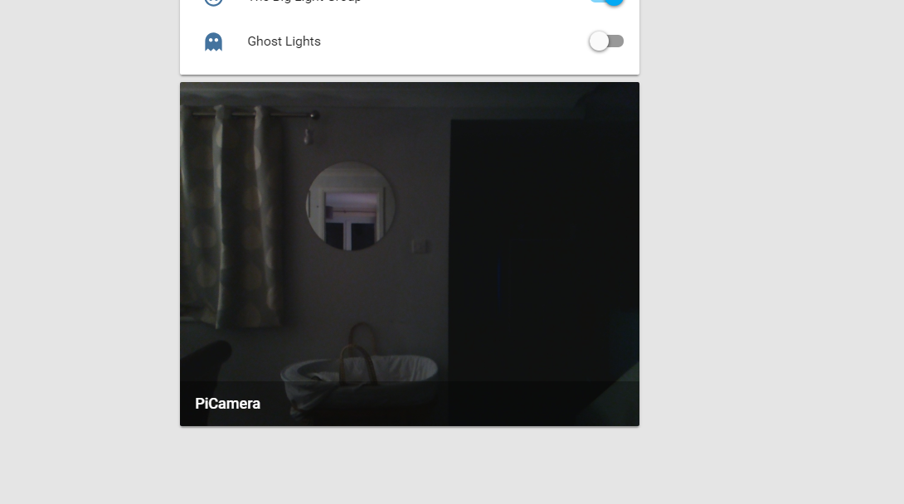
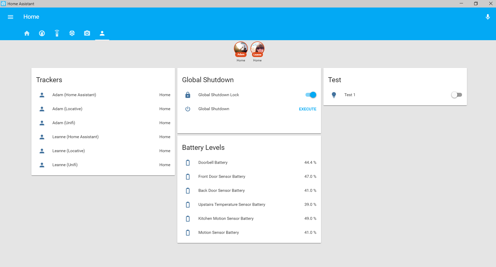

# My Setup
I run [Home Assistant](http://homeassistant.io/) in a docker contatiner on a Raspberry Pi 3. Details of my docker setup can be found in the [docker folder](https://github.com/Dullage/Home-AssistantConfig/tree/master/docker).

Currently there is very little in terms of in-configuration comments but if anyone has any questions I'm happy to answer.

# Presence Detection
I use 2 platforms for presence detection with a good sucess rate:

1. [Home Assistant iOS App](https://www.home-assistant.io/docs/ecosystem/ios/)
2. [Ubiquiti Wifi](https://www.home-assistant.io/components/device_tracker.unifi/)

The Ubiquiti tracking is slow to see you leave so I don't use it in the person groups, instead I just have an automation that steps in on the odd occasion the Home Assitant app fails to see us arrive (or is just slow). See [locationCleanup.yaml](https://github.com/Dullage/Home-AssistantConfig/blob/master/automations/locationCleanup.yaml).

# Highlights
Some highlights of our setup in no particular order:

* Google Home Minis for voice control and voice notifications (Google Cast) in most areas of the house.
* Chromecast Audios for whole house audio.
* Most house lights controllable via Home Assistant (a mix of Hue, Sonoff and WS2812 LED strips).
* Nest Thermostat.
* Broadlink RM Mini IR blaster for AV control.
* Motion detection for some lighting effects (Xiaomi Motion Sensors).
* The heating turns itself off as we goto bed ([bedtime.yaml](/automations/bedtime.yaml)).
* All lights turn off if everyone leaves the house. Lights turn on (at night) when someone comes home ([locationLights.yaml](/automations/locationLights.yaml)).
* ESP8266 controlled ceiling lights (see [this forum post](https://community.home-assistant.io/t/esp8266-sonoff-controlled-ceiling-lights/24141)).
* Double toggle a wall switch to perform a special function e.g. turn off every light on that floor (see [this repo](https://github.com/Dullage/SwitchedSonoffSimple) and [switchDoubleToggles.yaml](/automations/switchDoubleToggles.yaml)).
* iOS notifications when the doorbell is pressed ([doorbell.yaml](/automations/doorbell.yaml)). These include a video of the person walking up the path (see [this forum post](https://community.home-assistant.io/t/blink-camera-as-video-doorbell/65844)).
* iOS notifications if we both leave the house but a door or window is left open ([locationDoorWarning.yaml](/automations/locationDoorWarning.yaml)).
* RaspberryPi Screen running HADashboard. Screen turns on and off based on motion by the screen.
* Smart Microwave! See [this forum post](https://community.home-assistant.io/t/making-my-microwave-smart-ish/89843) and [this automation](/automations/microwave.yaml).

# Screenshots
Here are some screenshots from the front end and HA Dashboard:

## Main Tab

## Climate Tab

## AV Tab

## Miscellaneous Tab

## Camera Tab

## Admin Tab

## HA Dashboard

